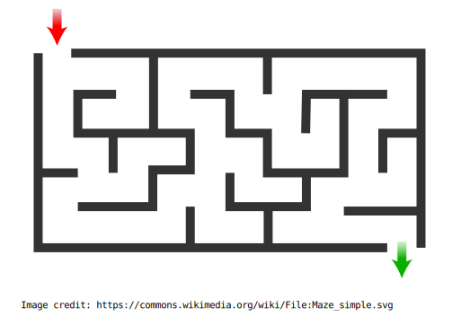

# Assignment 1: Algorithms
- Due January 22, 2023 by 11:59 pm
- Click on the [GitHub Classroom Link](https://classroom.github.com/a/nozENsU3) to clone your starter repo, then answer the questions below

## Table of contents <!-- omit in toc -->
- [Objectives](#objectives)
- [Outcome](#outcome)
- [Instructions](#instructions)
  - [Question 1. Algorithm tracing \& purpose](#question-1-algorithm-tracing--purpose)
  - [Question 2. Designing \& expressing an algorithm](#question-2-designing--expressing-an-algorithm)
  - [Question 3. Designing your own algorithm](#question-3-designing-your-own-algorithm)
- [Starter file](#starter-file)
- [Submission](#submission)
- [Marking scheme](#marking-scheme)


## Objectives
- Build problem solving skills.
- Gain experience developing algorithms.
  - Identifying, refining, ordering and arranging hierarchially a problem's algorithm into steps and sub-steps.
  - Clearly communicating the algorithm.
- Gain experience interpreting and communicating an algorithm's purpose.

## Outcome
- Successful submission (by the due date/time) of a text file, that correctly and completely expressing algorithms for all of the questions. 

## Instructions
1. Complete this assignment **individually or on groups of two**. Do **not** work together with more than one other classmate; that is unethical, counter to our university's and course's academic integrity policies, and deprives you and they of a learning opportunity. If you do work with another, **both students must independently submit their own copy of the work**, and **both names must be on the files**.
1. Respond to all of the following questions in the `assign1.md` file in your starter code.
1. To submit, every student must provide their own set of answers to the questions. If you worked in a pair, **both of you** should submit a copy of the work and include **both partners' names**.


### Question 1. Algorithm tracing & purpose
*5 marks. Emphasis on 'being the computer' & understanding an algorithm's purpose.*

Examine this algorithm:

```
ask user for an integer numberA
ask user for an integer numberB
if numberA > numberB
    swap numberA and numberB

iteration = 1
possible = numberB * iteration
while (possible / numberA) is not an integer
    increase iteration by 1
    possible = numberB * iteration

answer = numberB * iteration
display answer
```

1. Trace the algorithm **twice**, assuming the user first provides the numbers `6, 4` and then `9, 12`, in that order. Express the state of all variables at each step and the final answer displayed to the user.
   > **Tracing** is where you pretend to be the computer and write down the value of the variables at each step of the algorithm. For example, you might write the first two variables as:
   ```
   numberA = 6
   numberB = 4
   ```
   > You could also write this as a table, though it requires some Markdown [formatting](https://docs.github.com/en/get-started/writing-on-github/working-with-advanced-formatting/organizing-information-with-tables). You will not be assessed on your formatting or Markdown syntax, so however you choose to express the intermediate values is fine as long as it's clear.
   
   | numberA | numberB |
   | ------- | ------- |
   | 6       | 4       |

2. In a single concise sentence, describe what this algorithm is calculating. **Do not describe** the steps that the algorithm takes, but the meaning of the final answer.

### Question 2. Designing & expressing an algorithm
*5 marks. Emphasis on expressing the steps with sufficient detail and in the correct order.* 

Consider the bird's eye view of the following maze:



Beginning at the top left and ending at the bottom right, describe the algorithm to complete the maze **from the perspective of a person walking through it**. 

Assume that:
- The person cannot walk through walls
- The person can see walls
- The person can only walk in a forward direction
- The person can look in all directions
- The person can turn in all directions

### Question 3. Designing your own algorithm
*5 marks. Emphasis on algorithm design, identifying steps and sub-steps, & an ordered expression*

Recall something that **you** enjoy doing that you've had to work at to learn how to be proficient at it: 3D printing a toy, planting a garden, creating a craft etc. The only restriction: it cannot be a cooking recipe!

Pick an aspect of that talent that you can express as a short algorithm (20-30 lines or so). Develop and express that algorithm. Be sure to break your instructions down into sufficiently detailed sub-steps and communicate them in a clear order such that a classmate could follow your algorithm and be successful at it.

*Let a roommate or friend **not** in the course have a look at your algorithm and have them provide you some feedback: Is your algorithm clear? Are the steps in an order they can follow? Do they think you've provided enough detail?  Use their feedback (citing that they contributed) to improve your algorithm.*

## Starter file
Follow the link to GitHub Classroom to clone the starter repo for this assignment.

While the starter file has the extension ".md", it is just a text file. Using a simple text editor (like VSCode, Notepad or TextEdit) add your name (or names if you are working in pairs) and your responses to the three questions. Save the file and commit your changes as you work.

## Submission
You may push changes to GitHub any time up until the assignment deadline.

When you are done, copy the link to your repo and paste it into the appropriate D2L assignment text field, and then press the **submit** button. If you are using any late bank time (minimum of 0.5 days) indicate this as a note in your D2L submission.

You may continue to push changes after your first submission, but any changes committed to GitHub after the deadline will be considered late, regardless of the timestamp on your D2L submission.

If you choose to work in partners, include **both names** on your text file. Each partner is responsible for submitting a copy of the assignment!

## Marking scheme
The entire assignment will be graded out of 15 marks, 5 marks per question. Marks for the questions will be allocated as follows:

| Question | A Grade (5)                                                                                                | B Grade (4)                                                                   | C Grade (3)                                                                                       | D Grade (2.5)                                                                   | F Grade (0)             |
| -------: | :--------------------------------------------------------------------------------------------------------- | :---------------------------------------------------------------------------- | :------------------------------------------------------------------------------------------------ | :------------------------------------------------------------------------------ | :---------------------- |
|       1. | Complete trace. Algorithm's purpose correctly/clearly communicated.                                        | Small errors in trace. Algorithm's purpose is correctly/clearly communicated. | Larger errors in trace OR purpose is not clear.                                                   | Not fully/correctly traced AND incorrect/unclear purpose.                       | Not done or plagiarized |
|       2. | Algorithm clearly expressed & sequenced, and includes sufficient steps & details to be to be reproducible. | Algorithm clearly expressed & sequenced, BUT **missing a few details**.       | Algorithm clearly expressed BUT is **unclear in sequence OR is missing important details/steps.** | Algorithm **not clearly expressed** AND is **missing important details/steps.** | Not done or plagiarized |
|       3. | Algorithm clearly expressed & sequenced, and includes sufficient steps & details to be to be reproducible. | Algorithm clearly expressed, sequenced, BUT **missing a few details**.        | Algorithm clearly expressed BUT is **unclear in sequence OR is missing important details/steps.** | Algorithm **not clearly expressed** AND is **missing important details/steps.** | Not done or plagiarized |
