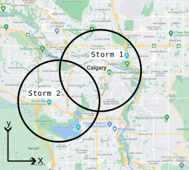
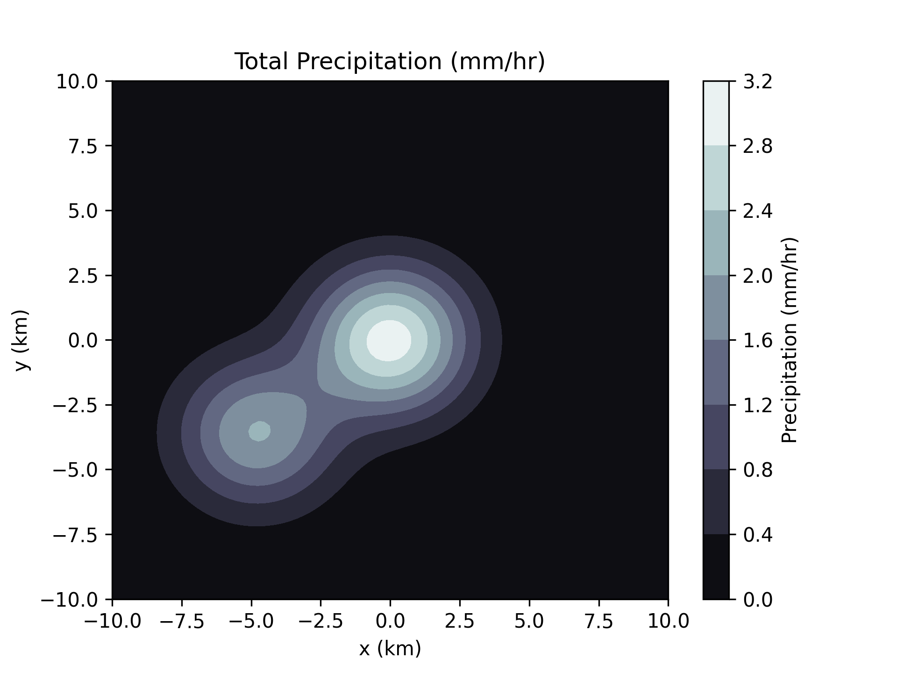

# Assignment 2: Input, processing, and Output
- Due February 5, 2023 by 11:59 pm
- Click on the [GitHub Classroom Link](https://classroom.github.com/a/Q3Hdjb1t) to clone your starter repo, then answer the questions below

## Table of contents <!-- omit in toc -->
- [Objectives](#objectives)
- [Outcomes](#outcomes)
- [Background Info](#background-info)
- [Deliverables](#deliverables)
  - [Manual calculation document](#manual-calculation-document)
  - [Python script](#python-script)
  - [Research efforts](#research-efforts)
- [Starter files](#starter-files)
- [Submission](#submission)
- [Marking Scheme](#marking-scheme)


## Objectives
Upon completion of this assignment, students will have had the opportunity to:
- Gain experience problem solving and debugging.
- Practice designing and expressing an algorithm as code that includes:
  - defining and using clear variable declarations, constants, and data types
  - reading and casting user input
  - mathematical operators, `math` module functions, and data types
  - displaying output with `fStrings`
  
## Outcomes
Done **individually or in pairs**, this assignment consists of **two products**:

1. A **manual calculation** document that shows the values of all intermediate calculations required to solve the problem. In order to help you debug your code, we are asking you to work out (with a calculator) and write out the intermediate values for each step. *You are encouraged to show a draft of your calculations to your instructor during the week before the due date.*
2. The **source code**: a Python script that calculates the amount of rain accumulated for any position entered by the user.

## Background Info 
You are working on a weather app that tells users how much rain is expected to accumulate in a given location. One common scenario[^1] is to have two simultaneous rain storms develop in close proximity. These storms are modelled as overlapping circles as shown on the following map:

[^1]: Common in our made-up over-simplified universe



For the purposes of this assignment, Calgary is represented as a 2D coordinate system with $(0, 0)$ located at the Calgary tower, with $x$ and $y$ extending East/West and North/South, respectively. Storm 1 is centred on the Calgary tower, and storm 2 is hovering over MRU.

The storms are equal in size, but differ in intensity. The amount of rainfall at any given point for a **single storm** is modelled as a 2D Gaussian function. A Gaussian function, hereafter referred to as a "Gaussian", is a function that produces a symmetric "bell curve" shape, used in this case to produce a semi-realistic model of rainfall intensity. The equation for a symmetric 2D Gaussian is given as [^2]:

$$rain(x,y) = A \exp\left(-\left(\frac{(x - x_0)^2 + (y - y_0)^2}{2 \sigma^2}\right)\right)$$

where $A$ is the amplitude of the storm in mm/hr, $x_0$ and $y_0$ are the positions of the centre of the storm, and $\sigma$ defines the radius of the storm. $\exp$ is the exponential function defined as $\exp(x) = e^x$, and can be found in Python's `math` module as `math.exp`.

For the two overlapping storms, the parameters are fixed as follows:

| Storm   | $A$     | $x_0, y_0$ | $\sigma$ |
| ------- | ------- | ---------- | -------- |
| 3 mm/hr | 0 km    | 0 km       | 2.2 km   |
| 2 mm/hr | -4.8 km | -3.6 km    | 2.2 km   |

Where the storms overlap, the accumulated rainfall sums together, producing the following pattern of combined rainfall intensity:



[^2]: https://en.wikipedia.org/wiki/Gaussian_function

## Deliverables
As part of your app, your users will use their location to predict the **total amount of rainfall accumulated** for any duration. Since we're in Canada, the meteorological data is in **mm/hr**, but your users want to know the accumulation in **inches**. For the purposes of this assignment, assume that the location data is given in our simplified $x,y$ coordinate system - you do not need to convert from latitude/longitude.

Write a program that prompts the user for inputs, performs the necessary calculations, then displays the output as specified.

Inputs:
- $x$ position in km
- $y$ position in km
- Storm duration in hours

Outputs:
- Total rainfall accumulated in **inches**, rounded to a single decimal place and displayed with the `"` symbol (**not** the same as `''`!)

A sample run of the program is as follows, where **bold** text is used to indicate user inputs:

<pre>
Enter the x position in km: <b>-2.5</b>
Enter the y position in km: <b>0</b>
Enter the rainfall duration in hours: <b>10</b>
You can expect a total of 0.7"
</pre>

### Manual calculation document
In the `calculation.md` starter file, choose an $x$ position between -10 and 10 km and a $y$ position between -10 and 10 km, then choose a duration between 1 and 10 hours. Define these as your inputs. Be careful when choosing your $(x,y)$ position - many locations within the city will **not** experience significant rainfall and will yield an answer close to zero, which is not a useful value for testing purposes! Refer to the total precipitation diagram in the [background info](#background-info) section to find a location with non-zero rainfall.

Using the equation for the Gaussian and the parameters for the two storms given above, calculate the total amount of rainfall at your chosen location using a standard scientific calculator. Write down any intermediate steps of the calculation to show your work, and record the final answer in the **output** section.

### Python script
In the `assign2.py` starter file, write a Python program that does the following:

1. Prompts the user to enter $x$ in km, $y$ in km, and duration in hours, in that order.
2. Calculates the total rainfall accumulated at the given position, modelling each storm as a Gaussian.
3. Displays the total accumulation in inches rounded to 1 decimal place.

Your script should follow Python style guides, meaning:
- Use descriptive variable names
- Use named constants where appropriate
- Include comments if needed to clarify code behaviour

Your code **must not** use use any Python techniques that have not yet been covered in class. This means it **cannot** use:
- older style string formatting (`%` or `.format`)
- if/else
- loops
- lists, tuples, dictionaries, or other data types beyond `int`, `float`, and `str`
- try/except
- custom classes
- modules aside from the `math` module
- **This is not a complete list!**

> Why not? There are many Python solutions to problems such as these out there in the wild, and if I see advanced concepts in your code, I have no way of knowing that you understand what you are writing. If you have prior Python experience, consider it a challenge to solve the problem using a limited set of tools.

### Research efforts
Although background information is presented here, a good problem solver knows to conduct their own research. If you don't understand some aspect of the material, consult with your partner and/or look it up. You will find solutions and online calculators for this type of problem on the internet, but ***you must ALWAYS cite the sources of your ideas.*** 

Citing can be done by adding comments like these to your code:

```python
# Algorithm inspired by http://citebay.com/how-to-cite/stackoverflow/
# Jordan Pratt helped me with the next four lines
```

## Starter files
Follow the link to [GitHub Classroom](https://classroom.github.com/a/Q3Hdjb1t) to clone the starter repo for this assignment. There are two documents for you to complete: `calculation.md` for your manual calculations, and `assign2.py` for your Python script. The file `test_assign2.py` is to help you test if your code meets the requirements - feel free to look at it, but do not modify it.

## Submission
You may push changes to GitHub any time up until the assignment deadline.

When you are done, copy the link to your repo and paste it into the appropriate D2L assignment text field, and then press the **submit** button. If you are using any late bank time (minimum of 0.5 days) indicate this as a note in your D2L submission.

You may continue to push changes after your first submission, but any changes committed to GitHub after the deadline will be considered late, regardless of the timestamp on your D2L submission.

If you choose to work in partners, include **both names** on your text file. Each partner is responsible for submitting a copy of the assignment!

## Marking Scheme
A handful of tests are provided for you to check that you are on the right track. However, passing these tests is not sufficient to ensure full marks!

Tracing (each part out of 4 = 16):
- [ ] Clear flow so that steps are easy to follow.
- [ ] Both Gaussians are correct.
- [ ] Appropriate choice of test values (e.g. non-zero precipitation).
- [ ] Final answer is correct, including unit conversion.

Source code (each part out of 4 = 28):
- [ ] No syntax errors (runs).
- [ ] Code style (variable names, readability, comments as appropriate, etc).
- [ ] Input prompts are clear and in expected order.
- [ ] Appropriate data types are used throughout.
- [ ] Math and algorithm are correct (no logic errors).
- [ ] Final answer is correct, including unit conversion.
- [ ] Output is clear, has correct number of decimal places, and shows symbol.

Total out of 44

*Note:*  
0/4 means not done or missing.   
1/4 means major errors.  
2/4 means major error or many small errors.   
3/4 means a few small errors.    
4/4 is correct/complete.

Remember: Your code **must not** use use any Python techniques that have not yet been covered in class. Use of more advanced techniques will result in a penalty and a discussion with me to explain your decisions.