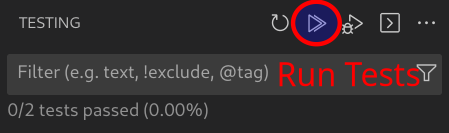
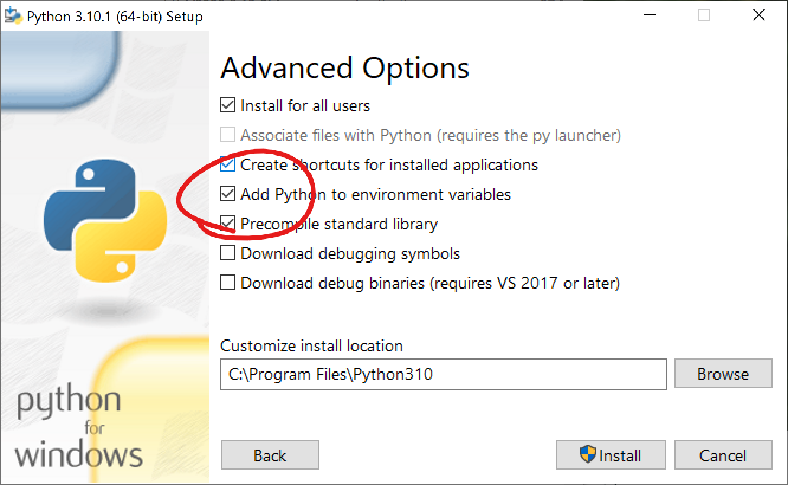

# Intro to Python
[GitHub Classroom Link](https://classroom.github.com/a/2d0NoVnm)

## Objectives
The goals of this lab are to:
- Get familiar with VS Code and Python
- Write and run your first Python program
- Break some code, make note of error messages, and fix it again

## Setup
1. If you're working on a personal computer and need to install Python, VS Code, or the Python extension, jump to [Software Installation](#software-installation) and follow the instructions. Lab computers have all the software installed.

    > _**note:** When you use a given lab computer for the first time, VS Code will take some time to load some extensions. You can still use the app, but you might get some windows and dialogs getting up in your grill a bit. If you use that same computer at a different time, this process won't happen...but if you use **another** computer, the process **will** repeat._

2. Launch VS Code. You may need to select File -> Close folder to close last week's lab work and activate the button to clone a new repository. As with lab 01, click on the [GitHub Classroom link](https://classroom.github.com/a/2d0NoVnm) to accept this lab and clone the starter code. Refer to [lab 01 instructions](https://github.com/MRU-W23-CS1/instructions/blob/main/labs/01-intro-to-git/README.md) for a refresher on the cloning/committing/syncing process.
3. Open the folder you just cloned in VS code. 
4. Get familiar with the three main windows in VS Code: the text editor, the side bar, and the integrated terminal.

## Hello, world!
1. Create a new **empty file** named `hello.py` (File -> New Text File, or keyboard shortcut Ctrl+N).
2. Run your code! There are (at least) three different ways - try them all and see what you like best:
   1. Press the triangle "play button" at the top right of the VS Code editor.
   2. Press `Ctrl + F5` on your keyboard.
   3. From the integrated terminal, type the command `python hello.py` (windows), or `python3 hello.py` if you are on mac/linux and press enter.
    Running the code should do nothing, but if there is an error, tell your instructor.
3. Add Python code so that when you run hello.py again, you see the following:
    ```plaintext
    Hello, world!
    ```
    > Hint: the `print` function displays output to the terminal.
    Remember to save your file after making a change, either with File -> Save or the keyboard shortcut "Ctrl+S".
4. Experiment! Try the following to see what happens, then undo the change and move on to the next. Remember to save and run your file after each change. Try to understand the error messages that appear, and don't hesitate to ask your instructor or IAs for an explanation.
   
   > To re-run your Python command in the terminal, click on the terminal pane to make sure it's active and then press the up arrow key. This will re-type your previous command to make things faster.
   1. Add a space *before* your `print` command.
   2. Add a space *after* your `print` command, but before the `(`.
   3. Add a space after the `"`, but before the `H` in `"Hello, world!"`.
   4. Change the `p` in `print` to a capital letter.
   5. Add a comment (a line starting with `#`).
   6. Define a variable and print it instead of printing `"Hello, world!"` directly.

5. After experimenting, undo your changes so that it prints `"Hello, world!"` again. In order to pass the autograded tests it must be written *exactly* as shown - not `"hello, world!"` or `"Hello, World!"` or any other variation.

> Writing code is a lot like typing in a password. Case matters, white space matters, punctuation matters... even if it looks "exactly the same" as the instructions, it may not be!

## Debugging
1. Open the `fix_me.py` file and run it. What kind of error occurs?
2. Fix the code so that it prints out your name, your age in years, and your age in months.
3. Where indicated, uncomment the code by deleting the `#` at the start of each line. You can also highlight all three lines and use the keyboard shortcut Ctrl+/ to toggle comments. Run the code again to see what happens.
4. Fix the code so that it prints out your year and program.

## Running tests
As with lab 01, your lab will be autograded with a set of tests. This time, there are 2 tests: one looking at `hello.py` and the other testing `fix_me.py`. You could just push changes to GitHub to see if these tests pass, but it's a lot faster to run the tests locally.

To run the tests through VS code, click on the "Testing" icon  on the left hand side, then press the double triangle "Run Tests" button to run all tests. If you see green checkmarks, you're done! If you see any red "x"s, that means that one or more tests failed. Click on the red x to expand the list of tests and figure out which ones failed.



> If you run tests and see "Pytest Discovery Error", this means you need to install the pytest package. Open up a terminal and type the command `pip install pytest`, or on a mac, `pip3 install pytest`, then try running tests again. You may need to click the "Refresh Tests" button, to the left of "Run Tests".


## Software Installation
1. Download and install [VS Code](https://code.visualstudio.com/) for your platform (macOS/Windows).
2. Run VS Code, and follow the prompts to install the [Python extension](https://marketplace.visualstudio.com/items?itemName=ms-python.python).
3. Finally, install the Python interpreter for your operating system.
### Windows
Download and install [Python](https://www.python.org/downloads/windows/). Choose the latest "Download Windows installer (64-bit)" under **Stable Releases**

When installing Python, make sure to check the option to "Add Python to environment variables" on the Advanced Options page:



Verify that it was installed correctly by running Git Bash and typing the following command:

```bash
python --version
```

### macOS
Download and install [Python for macOS](https://www.python.org/downloads/macos/). Choose the latest **stable** release labelled "macOS 64-bit universal2 installer"

Verify that it was installed correctly by running Terminal.app and typing the following command:

```bash
python3 --version
```

>On a Mac, the `python` command runs an old version of Python, which **will not work** with this course, so make sure to use `python3` every time you want to run Python.