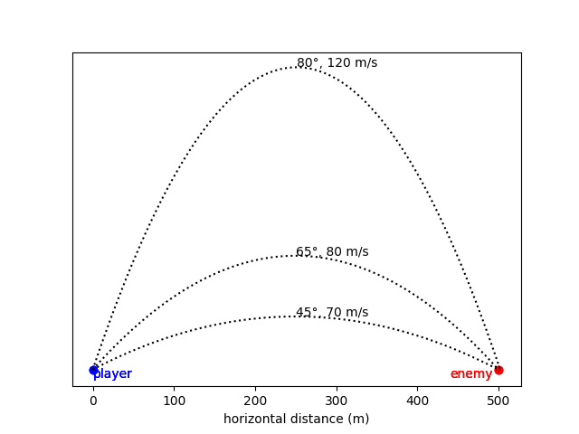

# Debugging & Testing

 [GitHub Classroom Link](https://classroom.github.com/a/xElnPaZs)

## Introduction
Imagine your company is developing a turn-based tank battle game (like the classic [Scorched Earth](https://en.wikipedia.org/wiki/Scorched_Earth_(video_game)) game). Players take turns selecting a **launch angle** and **velocity** to launch a projectile at the other player, and the first to hit their opponent wins.

Unfortunately, your coworker has just won the lottery and quit, leaving you with some half-finished code. She has written a function to compute how far a projectile will travel given a launch angle and velocity, but the code hasn't been debugged yet.

Projectile kinematics says that for a projectile launched on a flat surface, the flight-time (time in the air, until the projectile lands) satisfies the quadratic equation:

$$\frac{1}{2} gt^2 + v\sin(\theta) \times t = 0$$

where:
- $t$ is the flight time in seconds
- $\theta$ is the angle of launch
- $v$ is the velocity of launch in m/s
- $g$ is acceleration due to gravity (9.81 m/s² on earth) 

Given velocity $v$ and angle $\theta$, this equation can be solved for $t$ as follows:

$$t = \frac{v \sin(\theta)}{\frac{1}{2} g}$$

Once you have a value for $t$, you can find the horizontal distance travelled by:

$$x = v \cos(\theta) \times t$$

where:
- $x$ is the horizontal distance travelled
- $v$ is the velocity of launch in m/s
- $\theta$ is the angle of launch
- $t$ is the flight time in seconds

Your coworker has written the function below to compute horizontal distance travelled by a projectile. The intent of the function is to accept launch angle and velocity as parameters, use the [quadratic formula](https://en.wikipedia.org/wiki/Quadratic_formula) to compute $t$, and then use $t$ to compute (and return) $x$ using the equation above.

She has already done the math on paper, and identified 3 trajectories (shown below) that would cause the projectile to travel *approximately* 500 m.

> Note: The 80° and 65° trajectories don't exactly hit the 500 m mark - but they are "good enough"!

*Figure 1: Three sample trajectories that will cause a projectile to travel 500 m*

## Part 1: Debugging
1. Open the file `lab05.py` and take at look at the functions defined.
2. Do some initial detective work by reading through he code and its comments:
    - [ ] Do you see any mistakes in the code right away?
    - [ ] Does the IDE highlight any errors that would prevent the code from running?

3. Manually trace the program and correct any obvious syntax errors.

4. Test `calculate_landing_point` using the three angle-velocity pairs in Figure 1 above as test inputs to the function. The first one is defined for you in `main`. Is the output close enough (within 5m) to the expected 500 m for all 3 cases?

5. Find and correct all the bug(s) in the code. **Hint: there are 3 bugs!**

6. Think about how you fixed the code. Which of these debugging techniques did you use to find the bugs?
    - [ ] visual inspection
    - [ ] letting the IDE highlight syntax errors
    - [ ] checking whether code implements the intended functionality
    - [ ] manual code tracing
    - [ ] commenting out some lines of code to simplify the program
    - [ ] adding `print` statements to print out intermediate results for inspection
    - [ ] using breakpoints and IDE debugger to step through the code
    - [ ] calling a function with test inputs to check its functionality
    - [ ] running the test suite
    - [ ] anything else not on this list?

## Part 2: Checking for a hit
Calculating distance travelled is a necessary part of the game implementation, but ultimately you want to know if you hit the opponent.

1. Define a new function named `is_hit` that takes two `float` arguments and returns a `bool`. The arguments are the actual distance to the target and the distance travelled by the projectile.
   > Note: while `calculate_landing_point` can be used to get the distance travelled by the projectile, `is_hit` is an **independent function** that does not depend on the success of Part 1. This is part of the power of functions - you are able to test components of the overall program separately.
2. Implement a selection structure so that `is_hit` returns `True` if the two distances are **less than** 10 m apart, or `False` otherwise.
3. Come up with some test values to check your `is_hit` function, and print out the result in `main`. What test values do you need to make sure the function is fully tested?

    > Hint: `is_hit` needs 7 test cases! The test code provides more, but some are redundant.

## Testing
There are only 2 tests in this lab, one for part 1 and one for part 2. Both must be passed to get credit.

Note: the tests will give you a "Test Discovery Error" when syntax errors are present in the lab05.py file, so you need to fix those before you can run the tests.